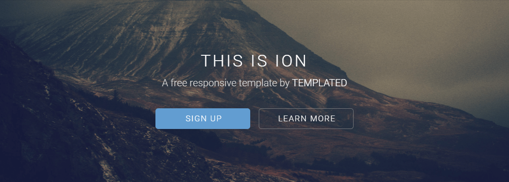

## Ion by TEMPLATED

### Introduction

This is Ion theme designed by TEMPLATED and adapted for Bolt.

+**Note:**  This is for Bolt 3. Check out the `bolt-v2` branch for a Bolt 2 compatible version.
+

### Configuration

There are three different options to set up the view for one record using Ion theme:

- With no sidebar
- With a sidebar on the left
- With a sidebar on the right

To set up one of those options, modify your `config.yml` file by choosing one of the templates for the record_template option:

`record_template: record.twig`
`record_template: record-sidebar-left.twig`
`record_template: record-sidebar-right.twig `

Don't forget to clear yor cache every time you make changes.

Check the screenshots folder to discover more of this theme.
